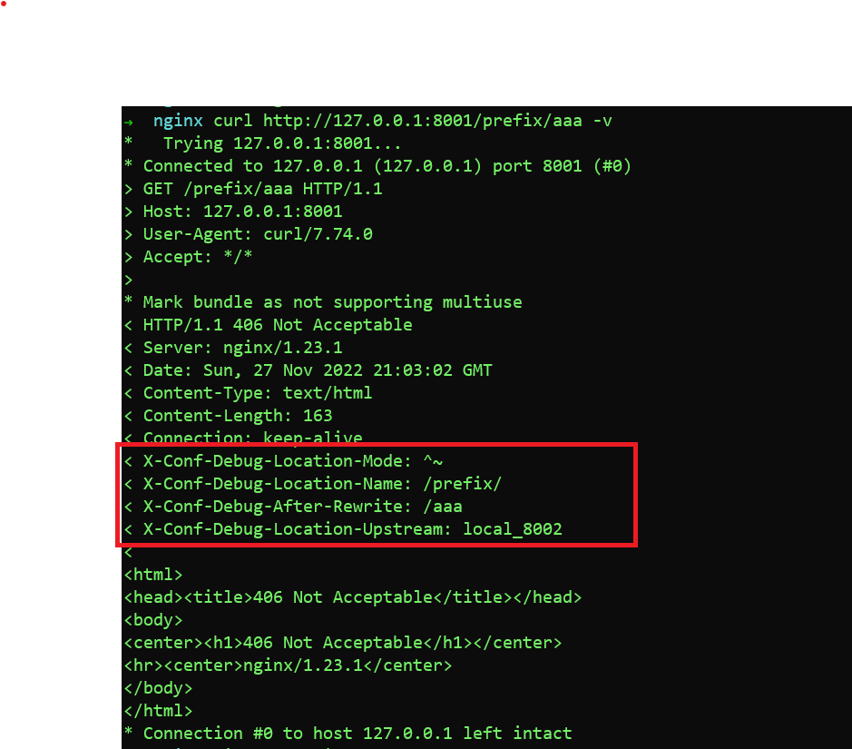

# ngx_http_conf_debug_module

verion: 1.0.0

The ngx_http_conf_debug_module module is used for debuging nginx configuration.

In debug mode, module will add the config infomation in a Nginx variable when
a request incoming, which will affect the request processing.

In interrupt mode, module will intercept the request to prevent it from being
proxy_pass to upstream server(because we just want to test the config).Simultaneous limitation of access by address and by password is controlled by the [satisfy](https://nginx.org/en/docs/http/ngx_http_core_module.html#satisfy) directive

**Attention**:
1. In location scene:
   1. ~ and ~* 's accuracy rely on macro NGX_HTTP_CASELESS_FILESYSTEM hasn't been defined(On darwin, cygwin and win32 OS)
   2. Nested location and @named location is not supported
   3. Location has been internal redirected(rewrite) is not supported

## Example configuration

```

http {
    conf_debug_enable on;
    conf_debug_interrupt on;
    conf_debug_interrupt_code 406;

    add_header X-Conf-Debug-Location-Mode $conf_debug_location_mode always;
    add_header X-Conf-Debug-Location-Name $conf_debug_location_name always;
    add_header X-Conf-Debug-After-Rewrite $uri always;
    add_header X-Conf-Debug-Location-Upstream $conf_debug_location_upstream always;

    upstream local_8002 {
        server 127.0.0.1:8002;
    }

    server {
        listen 8001;

        location = / {
            proxy_pass http://local_8002;
        }

        location / {
            proxy_pass http://local_8002;
        }

        location /documents/ {
            proxy_pass http://local_8002;
        }

        location ^~ /images/ {
            proxy_pass http://local_8002;
        }

        location ~* \.(gif|jpg|jpeg)$ {
            proxy_pass http://local_8002;
        }

        location ~ \.Doc$ {
            proxy_pass http://local_8002;
        }

        location ^~ /prefix/ {
            rewrite /prefix/(.*) /$1 break;
            proxy_pass http://local_8002;
        }
    }
}

```
Result:



## Installation

Just simply add a parameter for "configure" command when building Nginx from source code. Example:
```
./configure --add-module=<dir-you-save-the-repo>/ngx_http_conf_debug_module
```

## Directive

**Syntax**: conf_debug_enable *on|off*;

**Default**: off

**Context**: http, server, location

Debug mode switch.

---

**Syntax**: conf_debug_interrupt *on|off*;

**Default**: off

**Context**: http, server, location

Switch for interrupt mode. If opened, request will be intercept

---

**Syntax**: conf_debug_interrupt_status_code *code*;

**Default**: 406

**Context**: http, server, location

If conf_debug_interrupt is set to on, reponse must be generated by Nginx. Response
status code default is 406.

## Embedded Variables

$conf_debug_location_mode: The request-matched location's mode

$conf_debug_location_name: The request-matched location's name

$conf_debug_location_upstream: The request-matched location's upstream
